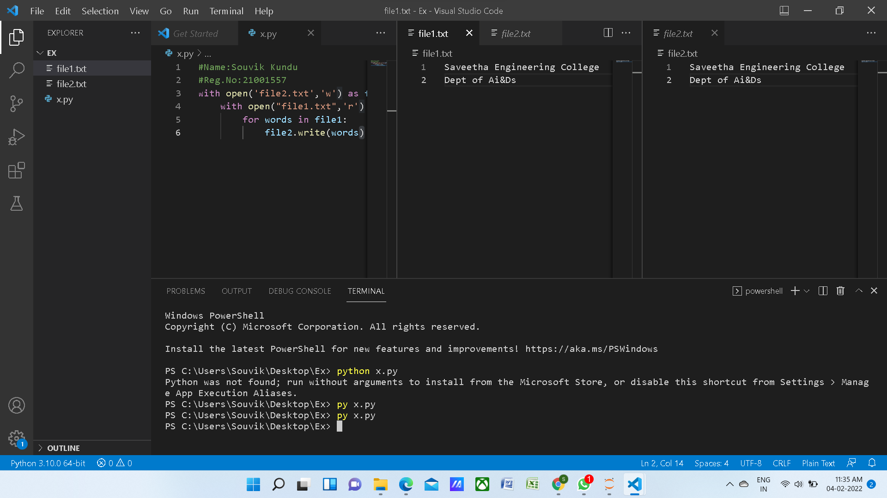

# copy-file
## AIM:
To write a python program for copying the contents from one file to another file.
## EQUIPEMENT'S REQUIRED: 
PC
Anaconda - Python 3.7
## ALGORITHM:

### Step 1:

Open a file which has to be filled.

### Step 2:

open a file which has to be copied.

### Step 3:

Using write function copy the file contents.
### Step 4:

Use with keyword to open the files
.
### Step 5:

Run the code using terminal.

### Step 6:

Now the contents are copied.

## PROGRAM:

#Name:Souvik Kundu
#Reg.No:21001557
with open('file2.txt','w') as file2:
    with open("file1.txt",'r') as file1:
        for words in file1:
            file2.write(words)

### OUTPUT:

## RESULT:
Thus the program is written to copy the contents from one file to another file.